# Casos de Uso del Sistema PideCerca

## 1. Descripción

Los casos de uso permiten representar las funciones que pueden realizar los diferentes usuarios dentro del sistema PideCerca.

El sistema cuenta con tres actores principales:

* **Cliente:** realiza pedidos y consulta el estado de sus pedidos.
* **Negocio:** administra sus productos y gestiona los pedidos recibidos.
* **Administrador:** supervisa y administra la plataforma.

## 2. Actores del sistema

### Cliente

El cliente puede:

* Registrarse e iniciar sesión.
* Gestionar su perfil.
* Buscar negocios cercanos.
* Seleccionar un negocio.
* Consultar el menú.
* Consultar productos.
* Agregar productos al carrito.
* Modificar el carrito.
* Confirmar el pedido.
* Realizar el pago.
* Consultar el estado del pedido.
* Consultar el tiempo estimado de preparación.
* Recibir notificaciones.
* Recoger el pedido.
* Consultar el historial de pedidos.

### Negocio

El negocio puede:

* Iniciar sesión.
* Gestionar la información del negocio.
* Gestionar categorías.
* Gestionar productos.
* Gestionar precios.
* Gestionar disponibilidad de productos.
* Recibir pedidos.
* Aceptar pedidos.
* Rechazar pedidos.
* Establecer el tiempo de preparación.
* Actualizar el estado del pedido.
* Marcar el pedido como listo.
* Confirmar el pedido recogido.
* Consultar el historial de pedidos.

### Administrador

El administrador puede:

* Iniciar sesión.
* Gestionar usuarios.
* Gestionar negocios.
* Habilitar o deshabilitar negocios.
* Gestionar categorías generales.
* Consultar pedidos.
* Supervisar el funcionamiento de la plataforma.

## 3. Diagrama general de casos de uso

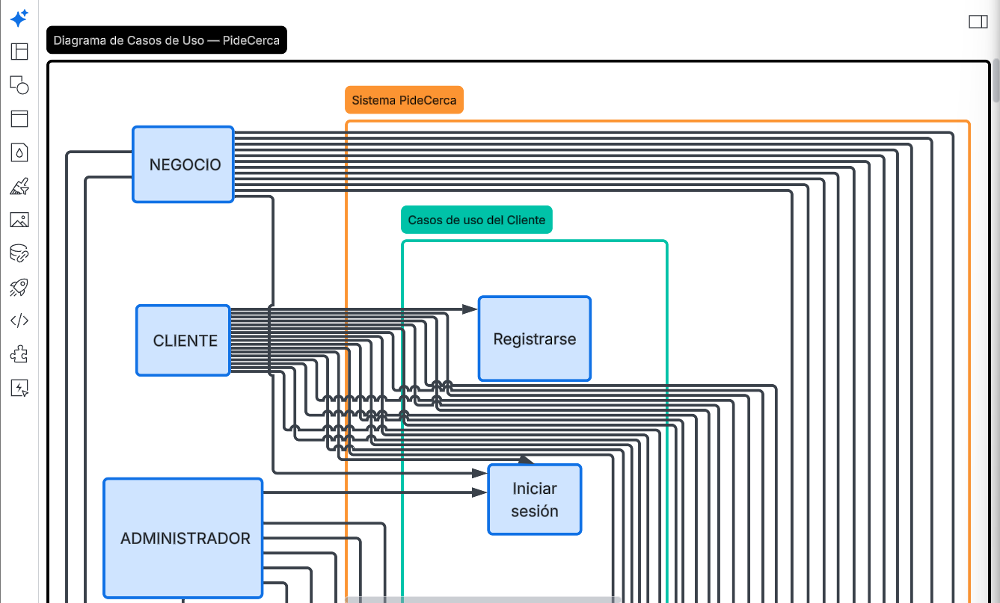

## 4. Casos de uso del Cliente

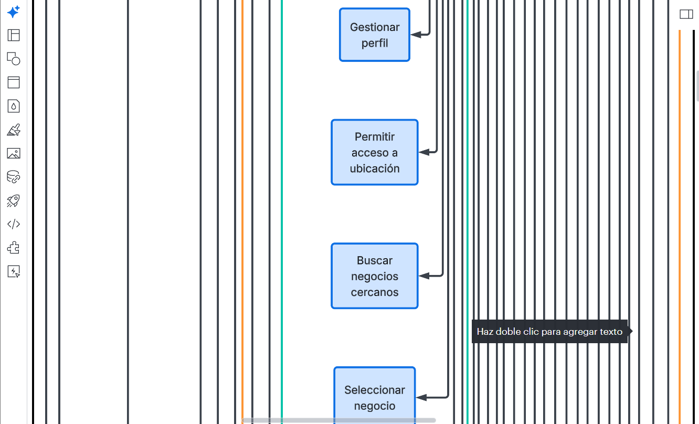

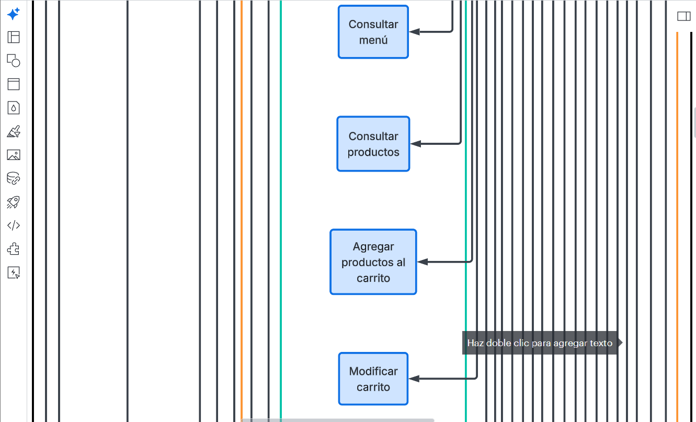

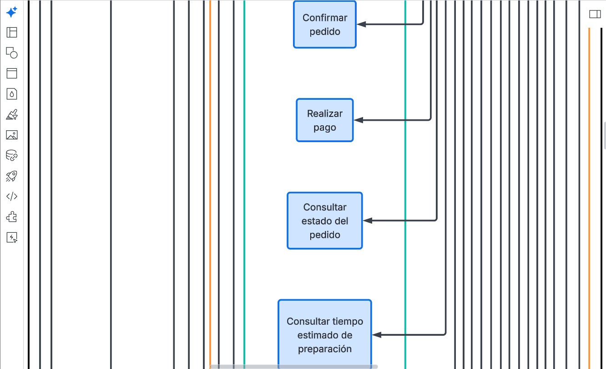

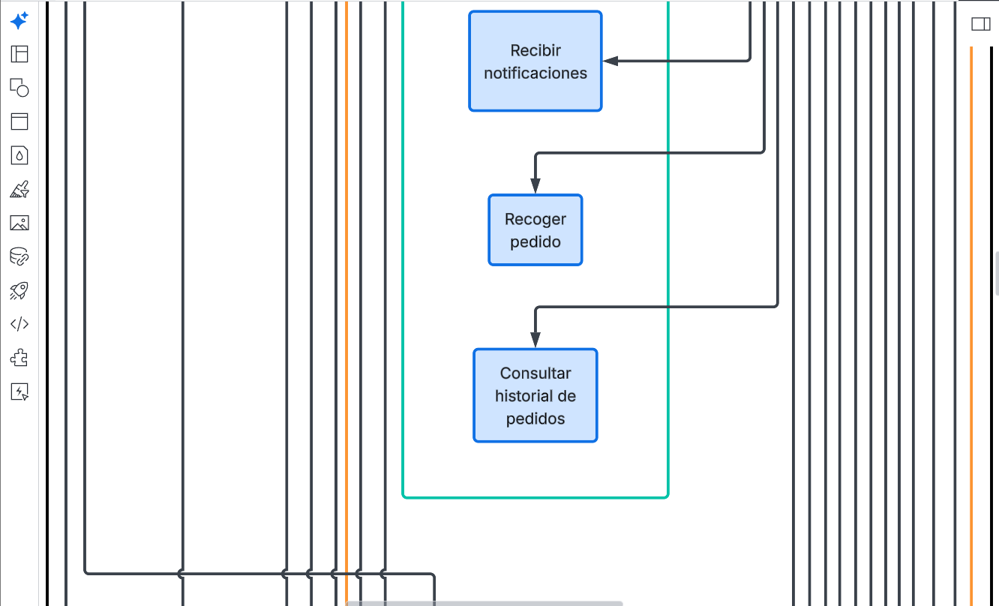

## 5. Casos de uso del Negocio

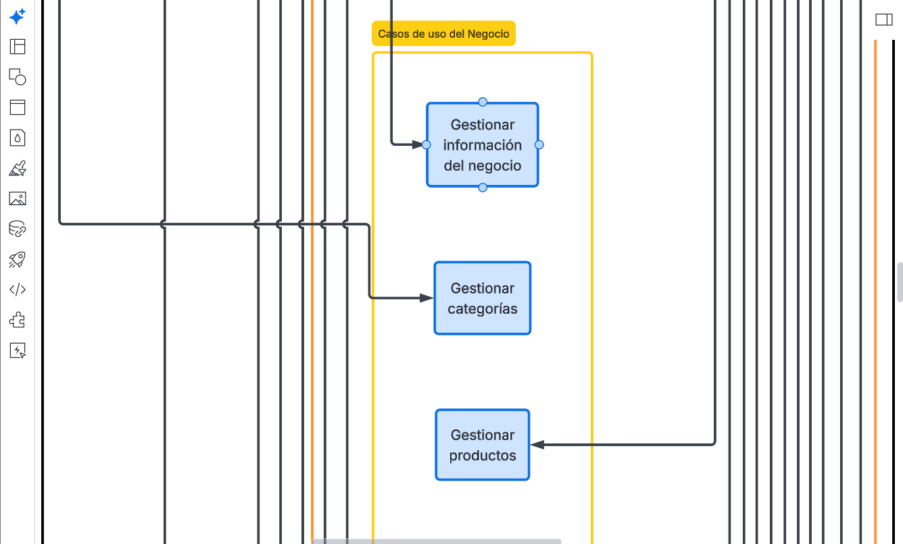

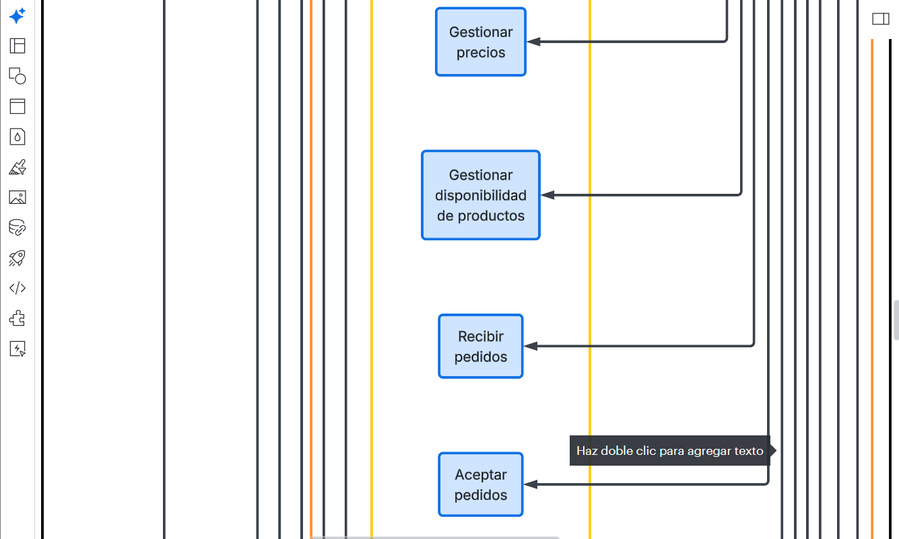

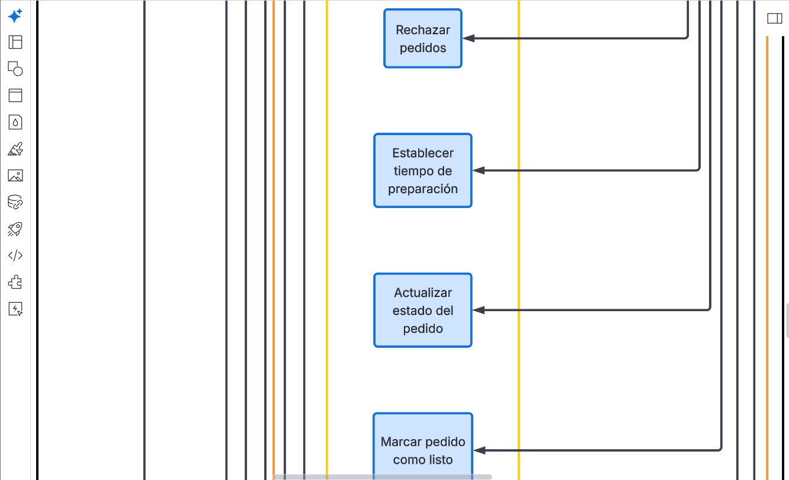

## 6. Casos de uso del Administrador

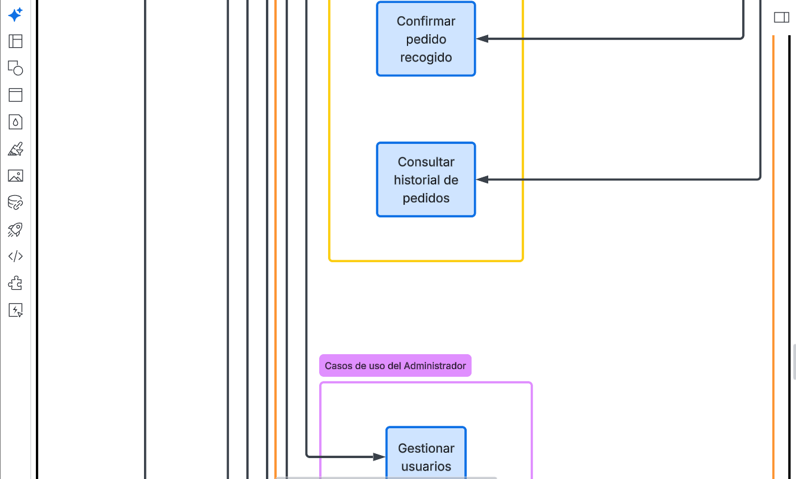

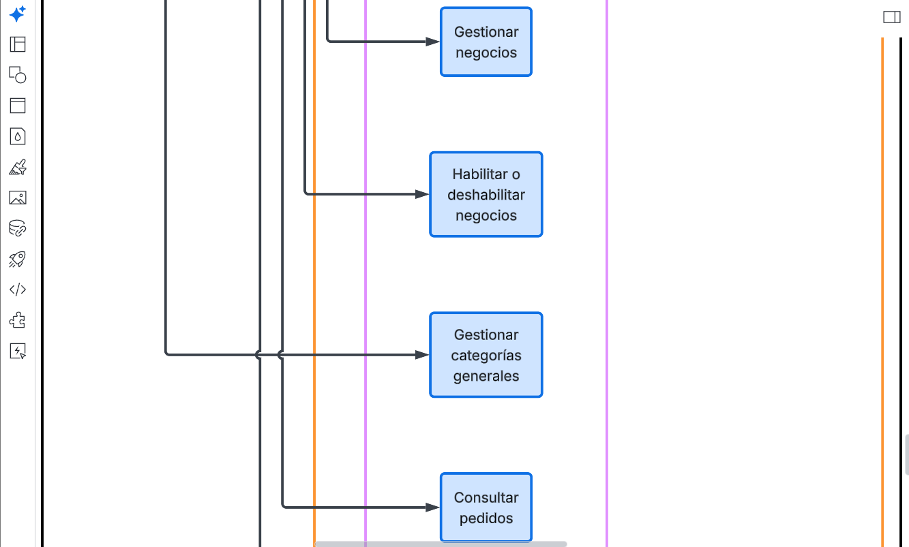

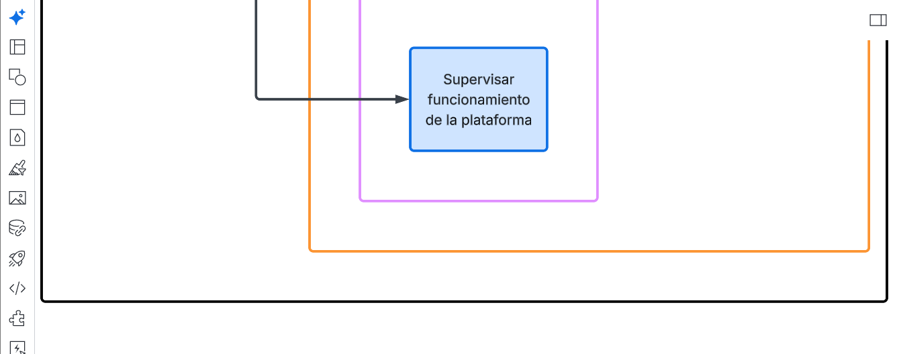

## 7. Flujo general del sistema

El cliente busca un negocio cercano, selecciona los productos que desea y los agrega al carrito.

Luego confirma el pedido y realiza el pago. El negocio recibe el pedido, lo acepta y comienza su preparación.

Finalmente, el negocio marca el pedido como listo y el cliente recibe una notificación para acudir al establecimiento y recogerlo.

## 8. Objetivo

El objetivo de los casos de uso es identificar claramente las funciones que tendrá PideCerca y las acciones que podrá realizar cada tipo de usuario.

Esta información servirá como base para el diseño de las interfaces y posteriormente para la implementación del sistema.
