# Diseño de Interfaces del Sistema PideCerca

## 1. Descripción

Las interfaces de PideCerca representan visualmente las pantallas principales del sistema para cada tipo de usuario.

El sistema cuenta con tres tipos de usuarios:

* Administrador
* Negocio
* Cliente

## 2. Interfaces del Administrador

Las siguientes imágenes representan las interfaces correspondientes al administrador del sistema.

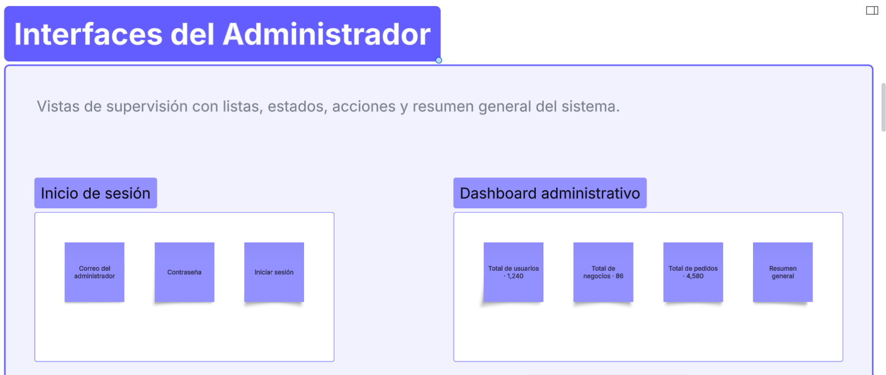

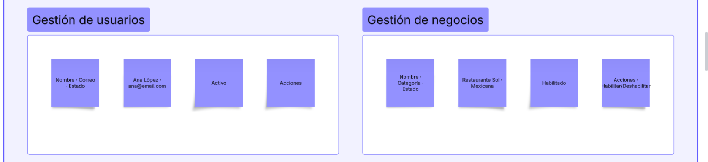

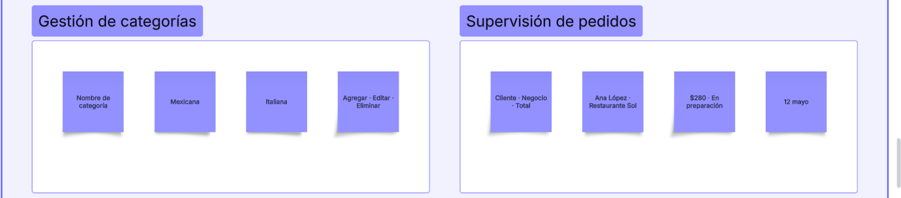

## 3. Interfaces del Negocio

Las siguientes imágenes representan las interfaces correspondientes al negocio.

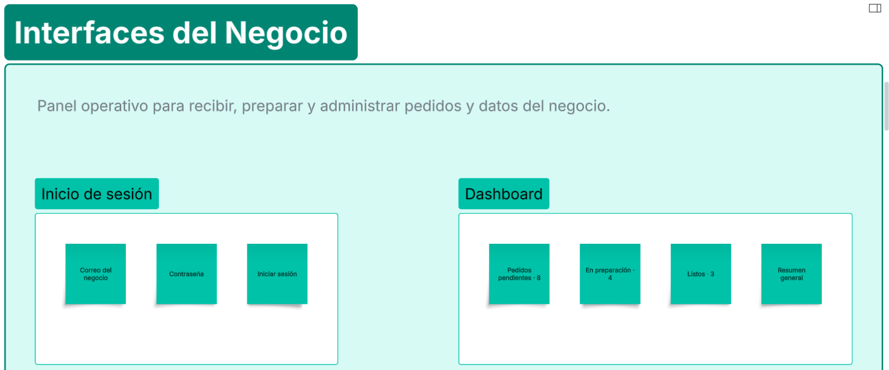

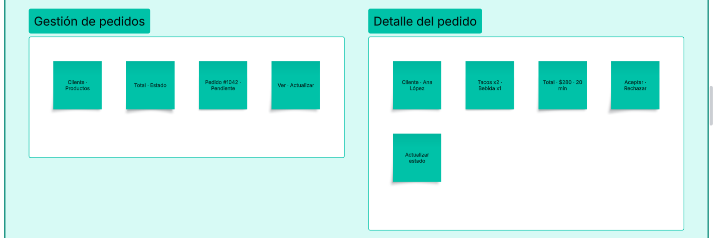

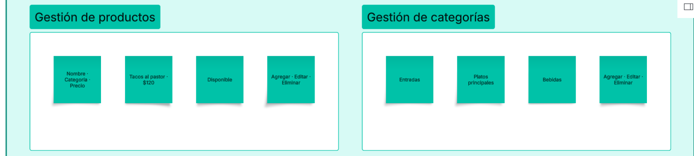

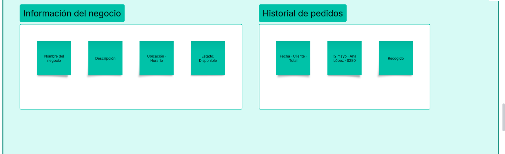

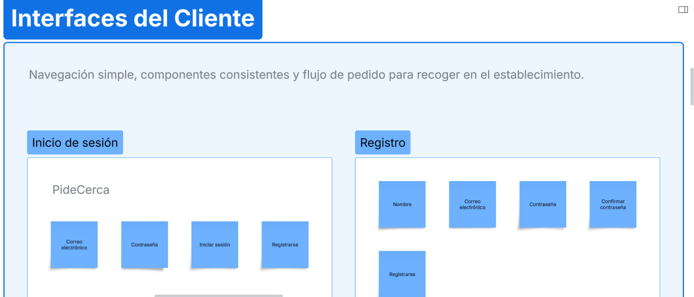

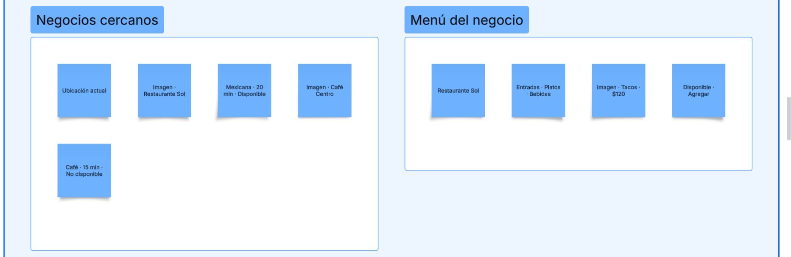

## 4. Interfaces del Cliente

Las siguientes imágenes representan las interfaces correspondientes al cliente.

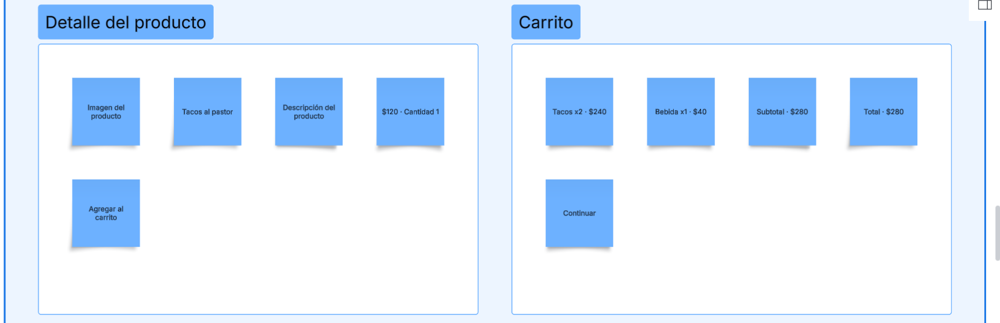

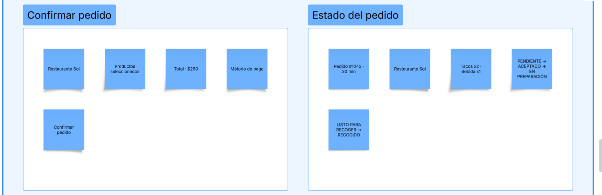

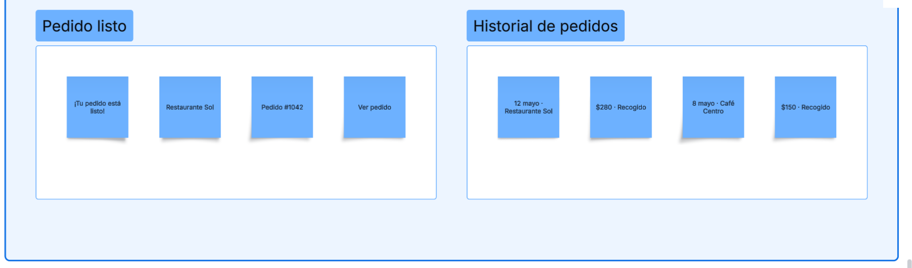

## 5. Objetivo

El diseño de interfaces permite establecer visualmente cómo interactuarán los diferentes usuarios con el sistema PideCerca.

Estas interfaces servirán como referencia para la implementación de la aplicación Android y las aplicaciones web del sistema.
